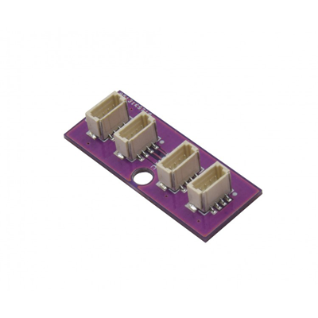

# Qwiic_Hub

> This product can be available for purchase [here](https://www.smart-prototyping.com/Zio-Qwiic-Hub.html).

#### Description

Want to split your Qwiic [bus](https://en.wikipedia.org/wiki/Bus_network) into a [tree](https://en.wikipedia.org/wiki/Tree_network)? Grab a hub! 

The Zio Qwiic Hub is a simple board with 4 Qwiic connectors in parallel. Just connect your main Qwiic bus to one of those ports, and split it into as many as three chains of modules.

Building a humanoid robotic torso and want to put a servo controller on each arm without creating unnecessary capacitance by running your bus down one arm and back to get to the other? Perfect! Just use the hub to split your bus, and you’re good to go.

The board is easily mountable due to the inclusion of a 3mm mounting hole.

#### Specification

* 4 Qwiic Connectors
* Weight: 5g
* Dimension: 30.1x12.0 mm

#### Links

* [Eagle files](https://github.com/ZIOCC/Qwiic_Hub)

> ###### About Zio
> Zio is a new line of open sourced, compact, and grid layout boards, fully integrated for Arduino and Qwiic ecosystem. Designed ideally for wearables, robotics, small-space limitations or other on the go projects. Check out other awesome Zio products [here](https://www.smart-prototyping.com/Zio).

> All Zio products are released under the [Creative Commons Attribution, Share-Alike License](https://creativecommons.org/licenses/by-sa/4.0/), and in accordance with the principles of the [Open Source Hardware Association's OSHW Statement of Principles 1.0 and OSHW Definition 1.0](https://www.oshwa.org/definition/).
